# wordpress-ha-aws

Déploiement d'une infrastructure WordPress de niveau entreprise sur AWS — hautement disponible, sécurisée, et entièrement automatisée.

---

## Architecture



## Stack Technique

| Composant | Service AWS | Rôle |
|---|---|---|
| Réseau | VPC, Subnets, IGW, NAT Gateway | Isolation et connectivité |
| Sécurité réseau | Security Groups | Firewall granulaire par couche |
| Serveurs web | EC2 + Auto Scaling Group | WordPress avec auto-réparation |
| Load Balancing | Application Load Balancer | Distribution du trafic Multi-AZ |
| Base de données | Amazon RDS MySQL | Persistance des données |
| Secrets | AWS Secrets Manager | Gestion sécurisée des credentials |
| Identité | IAM Role + Instance Profile | Accès sans clés d'accès |

---

## Structure du VPC

| Subnet | CIDR | AZ | Rôle |
|---|---|---|---|
| Public-Subnet-1 | 10.0.1.0/24 | us-east-1a | ALB |
| Public-Subnet-2 | 10.0.2.0/24 | us-east-1b | ALB |
| Private-Subnet-1 | 10.0.3.0/24 | us-east-1a | EC2 + RDS |
| Private-Subnet-2 | 10.0.4.0/24 | us-east-1b | EC2 + RDS |

---

## Sécurité — Chaînage des Security Groups

```
Internet → WP-ALB-SG (port 80)
              │
              ▼
         WP-Web-SG (port 80, source: WP-ALB-SG uniquement)
              │
              ▼
         WP-DB-SG (port 3306, source: WP-Web-SG uniquement)
```

Chaque couche ne fait confiance qu'à sa voisine directe. La base de données est inaccessible depuis Internet, même indirectement.

---

## Automatisation — User Data

Au lancement, chaque instance EC2 exécute automatiquement un script qui :

1. Installe Apache, PHP et les dépendances
2. Démarre Apache (`systemctl enable/start httpd`)
3. Récupère les credentials depuis **Secrets Manager** (aucun mot de passe en clair)
4. Télécharge et configure WordPress avec l'endpoint RDS

```bash
STR_SECRET=$(aws secretsmanager get-secret-value \
  --secret-id WP-DB-Secret \
  --region us-east-1 \
  --query SecretString \
  --output text)
```

---

## Auto Scaling Group

| Paramètre | Valeur |
|---|---|
| Desired | 2 instances |
| Minimum | 2 instances |
| Maximum | 4 instances |
| Health Check | ELB (grace period 300s) |
| Subnets | Private-Subnet-1, Private-Subnet-2 |

---

## Test de Résilience (Chaos Testing)

Une instance EC2 a été terminée manuellement pour valider la résilience :

- ✅ Le site WordPress est resté accessible pendant toute la durée du test
- ✅ L'ALB a redirigé automatiquement le trafic vers l'instance survivante
- ✅ L'ASG a détecté la panne et lancé une nouvelle instance en remplacement
- ✅ Aucune intervention manuelle requise

---

## Décisions Architecturales

**Free Tier vs Multi-AZ RDS** : L'architecture cible prévoit RDS Multi-AZ (réplication synchrone entre deux AZs). La contrainte Free Tier impose Single-AZ pour ce déploiement. En production, l'option Multi-AZ DB instance serait activée.

**4 subnets vs 6 subnets** : Une architecture production utiliserait 6 subnets (2 publics, 2 privés app, 2 privés data) pour isoler RDS dans sa propre couche réseau avec des NACLs dédiées. Ce déploiement utilise 4 subnets pour simplifier sans compromettre les Security Groups.

---

## Documentation Détaillée

→ [Architecture](docs/architecture.md)

---

## Problèmes rencontrés

### Apache non démarré au lancement
**Problème** : les instances EC2 échouaient au health check de l'ALB.  
**Cause** : `systemctl start httpd` absent du script User Data.  
**Solution** : ajout de `systemctl enable httpd && systemctl start httpd` 
après l'installation des packages.  
**Leçon** : installer un service ne le démarre pas — toujours l'activer explicitement.


---


## Compétences Démontrées (SAA-C03)

- Conception d'architectures sécurisées (IAM, Secrets Manager, Security Groups)
- Élimination des Single Points of Failure
- Haute disponibilité Multi-AZ
- Scalabilité horizontale avec Auto Scaling
- Principe du moindre privilège
